#Disposable Bag Classification Using Computer Vision

**Edge Impulse Link:** https://studio.edgeimpulse.com/public/184553/latest 

*In order to start task, please download the file 'Model in Arduino' and drag 'OV7675' and 'Bag_Classification_inferencing' into Arduino library first. If you want to use camera to make real photo and recongize, please open through Arduino IDE*

For Mac (Based on your own file location)
'Users/Documents/Arduino/libraries/Bag_Classification_inferencing/examples/nano_ble33_sense/nano_ble33_sense_camera/nano_ble33_sense_camera.ino'


---

## 1. Introduction 

The main application for this project is training appropriate model, embeding it into tiny machine learning device (Arduino Nano 33) to automatically classify household disposable bags.


## 2. Data (96*96)
Each Image was captured using OV 7675 camera in Arrduino Nano Board. Overall about three categories image  will be transmitted in network to build a model through training, valiating an testing. Model should be transfered to a format with tensorflow quantized int 8.

- Device and Parameter
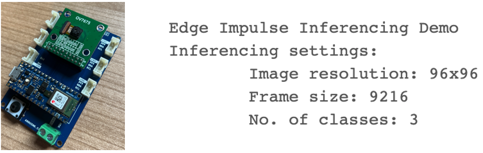


- Example Data

| Label| Image|
|:-:|:-:|
| Garbage Bag | |
| Plastic Bag | 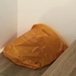|
| Paper Bag | |

---
## 3. Experiment 

### 3.1 Project Flow


cond2=>condition: Accuracy & Loss Plot 
### 3.2 Important Code
1. Data Augment

``` Python
train_generator = ImageDataGenerator(rescale=1/255, zoom_range=0.2, horizontal_flip=True, rotation_range=30)
val_generator = ImageDataGenerator(rescale=1/255)
test_generator = ImageDataGenerator(rescale=1/255)

train_generator = train_generator.flow(np.array(X_train), Y_train, shuffle=True)
val_generator = test_generator.flow(np.array(X_validate), Y_validate, shuffle=True)
test_generator = test_generator.flow(np.array(X_test), Y_test, shuffle=False)

```

2. **Primairy Model Building**

- Add MobileNet V1 from TensorFlow

- Add additional densor layer 

- Add Dropout process to aviod overfitting

``` Python

from tensorflow.keras.layers import Dense, Flatten
from tensorflow.keras.models import Model
INPUT_SHAPE = X_train.shape[1:]

base_model = tf.keras.applications.MobileNet(
    input_shape = INPUT_SHAPE,
    weights = 'imagenet',
    include_top=False,
    alpha = 0.25
)

x = Flatten()(base_model.output)
x = Dense(256, activation='relu')(x)
x = Dropout(0.2)(x)
x = Dense(128, activation='relu')(x)
x = Dense(3, activation='softmax')(x)

```


3. **Validation**

- Define the range of hypyer parameter
- Find best coombination according to score
``` Python

1.	learning_rates = [0.001, 0.01, 0.1]  
2.	batch_sizes = [5, 10, 16, 32, 64]  
3.	num_epochs = [10, 20, 30]  
4.	  
5.	def mbv1(learning_rate, batch_size, num_epochs,train_generator,test_generator):  
6.	  model = Model(inputs=base_model.input, outputs=x)  
7.	  
8.	  optimizer = tf.keras.optimizers.Adam(learning_rate=learning_rate)  
9.	  
10.	  model.compile(loss="categorical_crossentropy", metrics=["accuracy"], optimizer=optimizer)  
11.	  
12.	  history = model.fit(train_generator, batch_size = batch_size,epochs = num_epochs, validation_data=test_generator, shuffle=True, validation_steps=len(test_generator))  
13.	  scores = model.evaluate(test_generator)  
14.	  
15.	  return scores[1]   
16.	  
17.	best_accuracy = 0.0  
18.	for lr in learning_rates:  
19.	    for bs in batch_sizes:  
20.	        for ne in num_epochs:  
21.	            accuracy = m(lr,bs,ne,train_generator,test_generator)  
22.	            if accuracy > best_accuracy:  
23.	                best_accuracy = accuracy  
24.	                best_lr = lr  
25.	                best_bs = bs  
26.	                best_ne = ne  
27.	# Print the optimal hyperparameters  
28.	print('Optimal learning rate: {:.4f}'.format(best_lr))  
29.	print('Optimal batch size: {}'.format(best_bs))  
30.	print('Optimal number of epochs: {}'.format(best_ne))  


```

---

## 4. Experiment Results

- Training Accuracy & Loss

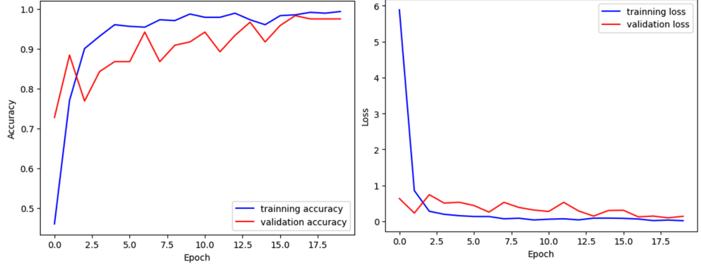

- Testing (152 Images) Confusion Matrix After Validation 
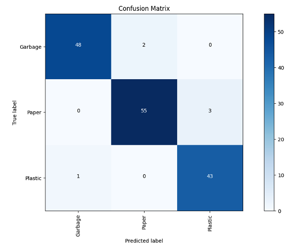

- Model Performance After Transforing to Quantized int8 

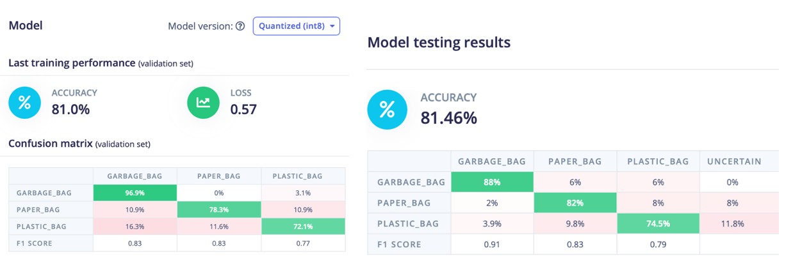

- Classification Results Through Arduino Nano Board Real Capturing Using Ov7675 Camera

| Real Capturing | Results From Embeded Model|
|:-:|:-:|
| 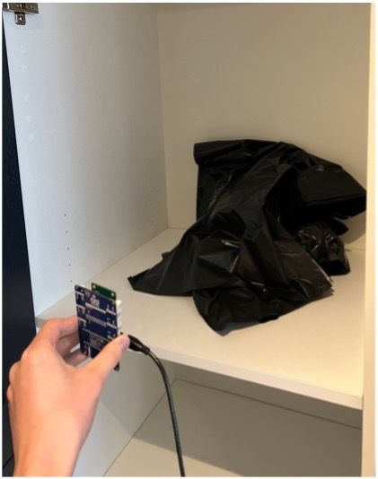 | 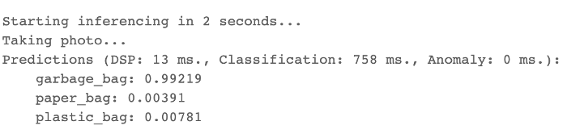|
| 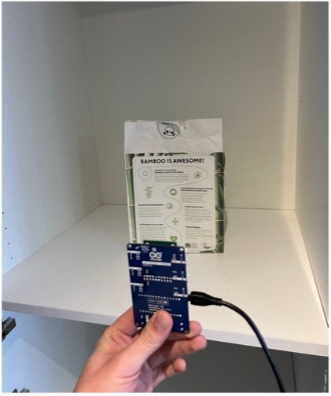 | 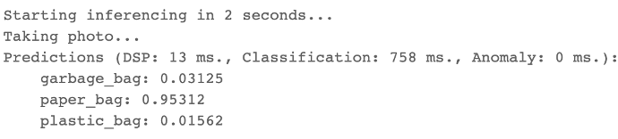|
| 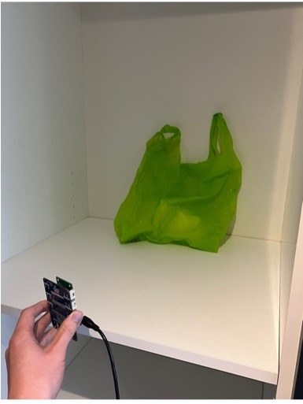 | 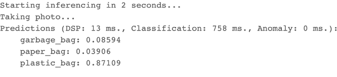|


